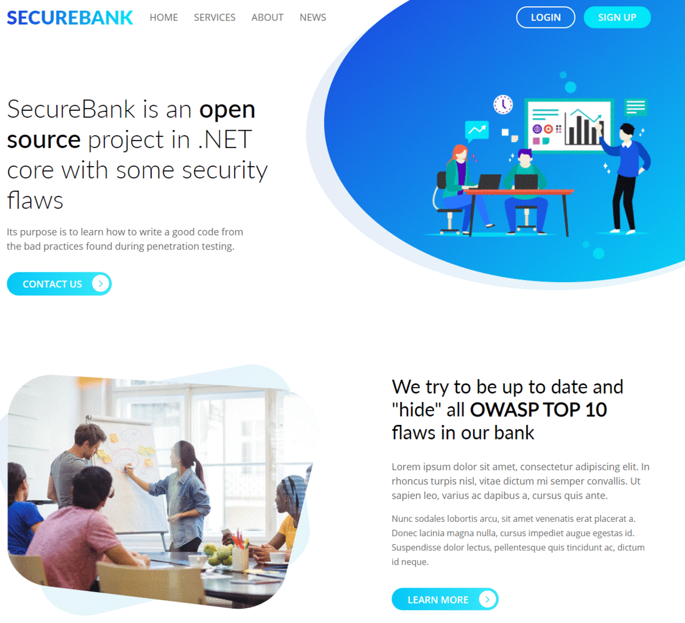

# SecureBank

SecureBank is a FinTech application which contains all OWASP TOP 10 security vulnerabilities along with some other security flaws found in real-world applications.

# Setup
> You can setup SecureBank application from source code or just pull from docker hub

## From source
> Make sure that you have Microsoft SQL Server DB available you can install it or run inside docker

1. Install [.NET Core 3.1 SDK](https://dotnet.microsoft.com/download/dotnet-core/3.1)
2. Install [Visual Studio 2019](https://visualstudio.microsoft.com/downloads/) or just run with  [Visual Studio Code](https://code.visualstudio.com/download)
3. Clone from GitHub
4. Navigate to directory SecureBank -> src
5. `dotnet run` or open solution in IDE and run there 

## From Docker
1. Install [Docker](https://docs.docker.com/get-docker/)
2. Run `docker run -p 80:80 -p 5000:5000 -p 1080:1080 ssrd/securebank`
3. Browse to [http://localhost:80](http://localhost:80)

## Docker with multiply containers
1. Install [Docker](https://docs.docker.com/get-docker/)
2. Install [Docker Compose](https://docs.docker.com/compose/install/)
3. Run `docker-compose up`

## CTF-Mode
If you want to run SecureBank in CTF mode we have also prepared this option. It will crate CTFd compatible export file.

Run  `docker run -p 80:80 -p 5000:5000 -e 'AppSettings:Ctf:Enabled=true' -e 'AppSettings:Ctf:Seed=example' ssrd/securebank`